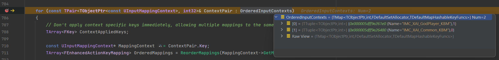
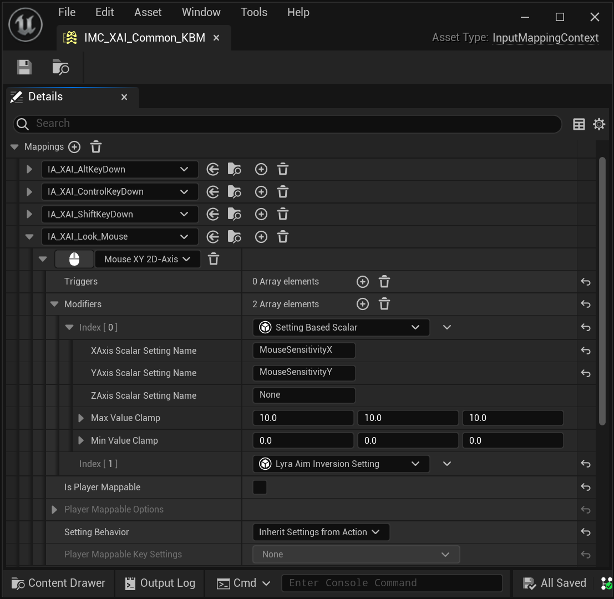

# Enhanced Input: Input Mapping Context

This info covers Enhanced Input as implemented in
[Lyra](/UE5/LyraStarterGame/) 5.2
based on `//UE5/Release-5.2`
from either UDN or GitHub.

- [Initialization in Game](#GameInit)
- [Changing Input Mapping Contexts (IMC) at Playtime](#ChangingIMCDuringPlaytime)
  - [Add IMC](#AddIMC)
  - [Remove IMC](#RemoveIMC)
  - [Clear All IMC](#ClearAllIMC)
- [Debugging Tip](#DebuggingTip)
- [Example IMC in Editor](#Example)


<a id='GameInit'></a>
# Initialization in Game

In Lyra, an initial Input Mapping Context (IMC) is configured via a Game Feature Action (GFA).

When a Game Feature Plugin (GFP) Loads *(also when Lyra Experiences load)*,
Game Feature Actions (GFA) are executed.
In Lyra, a GFA adds Inputs to any Pawn the player Possesses.
Part of the process includes adding Input Mapping Contexts (IMC)
for the Pawn.

If your game is based on Lyra, you get this for free.
All you have to do is configure your Experiences and Pawn Data.

Note that by default Lyra calls `ClearAllMappings` each time it initializes
inputs on a new pawn.
While this does help ensure a consistent IMC setup,
it also severely limits your options regarding persistent IMCs.

In my case, I commented out the `ClearAllMappings` and have my IMCs
loaded in additively.  This moves the responsibility to clear the list to a
scope higher than the Pawn.

I then configured my Experiences to load in only the **Common** IMCs
at a given priority.  Thus for every experience, the Common IMC will be loaded
automatically.  During gameplay then I 
[`AddInputMappingContext`](#AddIMC)
or [`RemoveInputMappingContext`](#RemoveIMC)
as desired when I want to change the player controls.


<a id='ChangingIMCDuringPlaytime'></a>
# Changing Input Mapping Contexts (IMC) at Playtime

During Gameplay you can change the Input Mapping Contexts (IMC).
You simply add/remove IMC from the Enhanced Input Subsystem as needed.

```c++
APlayerController* PC = nullptr;  // <-- YOU MUST ASSIGN THE PLAYER CONTROLLER TO NON-nullptr
if (ULocalPlayer* LP = PC->GetLocalPlayer())
{
    if (UEnhancedInputLocalPlayerSubsystem* Subsystem = LP->GetSubsystem<UEnhancedInputLocalPlayerSubsystem>())
    {
        // Do Subsystem Stuff...  Add IMC, Remove IMC, etc.
    }
}
```


<a id='AddIMC'></a>
## Add Input Mapping Context (IMC)

You can add new IMCs to the current applied context via
`Subsystem`➔`AddMappingContext`.

The current list of applied IMCs will be sorted and your new IMC will be considered
at whatever priority you assigned to it.

```c++
/**
 * Add a control mapping context.
 * @param MappingContext    A set of key to action mappings to apply to this player
 * @param Priority          Higher priority mappings will be applied first and, if they consume input, will block lower priority mappings.
 * @param Options           Options to consider when adding this mapping context.
 */
UFUNCTION(BlueprintCallable, BlueprintCosmetic, Category = "Input", meta=(AutoCreateRefTerm = "Options"))
virtual void AddMappingContext(const UInputMappingContext* MappingContext, int32 Priority, const FModifyContextOptions& Options = FModifyContextOptions());
```


<a id='RemoveIMC'></a>
## Remove Input Mapping Context (IMC)

You can remove one particular IMC via
`Subsystem`➔`RemoveMappingContext`

```c++
/**
 * Remove a specific control context. 
 * This is safe to call even if the context is not applied.
 * @param MappingContext    Context to remove from the player
 * @param Options           Options to consider when removing this input mapping context
 */
UFUNCTION(BlueprintCallable, BlueprintCosmetic, Category = "Input", meta=(AutoCreateRefTerm = "Options"))
virtual void RemoveMappingContext(const UInputMappingContext* MappingContext, const FModifyContextOptions& Options = FModifyContextOptions());
```


<a id='ClearAllIMC'></a>
## Clear All Input Mapping Context (IMC)

To remove **all** previously configured IMCs, use
`Subsystem`➔`ClearAllMappings`

```c++
/**
 * Remove all applied mapping contexts.
 */
UFUNCTION(BlueprintCallable, BlueprintCosmetic, Category = "Input")
virtual void ClearAllMappings();
```


<a id='DebuggingTip'></a>
# Debugging Tip

For debugging, see `IEnhancedInputSubsystemInterface`::`RebuildControlMappings`,
in particular breakpoint this line:
```c++
for (const TPair<TObjectPtr<const UInputMappingContext>, int32>& ContextPair : OrderedInputContexts)
```

The `OrderedInputContexts` will show you which IMC are being activated
as well as the order of priority (ordered from high to low priority).

This gets called when the active set of IMC changes.

[](./screenshots/Debugger-RebuildControlMappings.png)

The above screenshot shows an example of this breakpoint in action.


<a id='Example'></a>
# Example IMC in Editor

[](./screenshots/ExampleIMC-XAI_Common.png)
