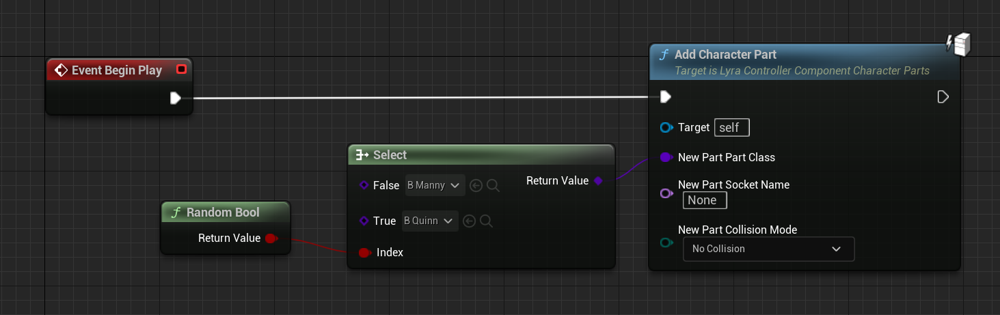
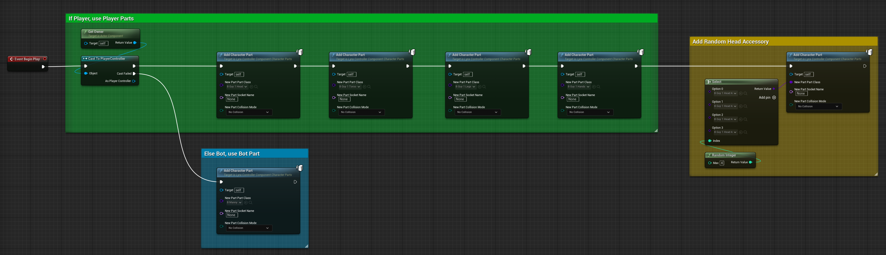

# Lyra Character Parts Controller Component

C++ Class: `ULyraControllerComponent_CharacterParts`
( Lyra 5.2
 [header](https://github.com/EpicGames/UnrealEngine/blob/5.2/Samples/Games/Lyra/Source/LyraGame/Cosmetics/LyraControllerComponent_CharacterParts.h)
|
 [cpp](https://github.com/EpicGames/UnrealEngine/blob/5.2/Samples/Games/Lyra/Source/LyraGame/Cosmetics/LyraControllerComponent_CharacterParts.cpp)
)

This is one part of the [Lyra Character Parts](/UE5/LyraStarterGame/CharacterParts/) system,
see that page for an overview.

## Conceptual Overview

The Character Parts Controller Component is responsible for choosing which
Character Parts to add to any given Pawn.

When the Controller Component starts up (in `BeginPlay`), it should initialize its idea of
which Character Parts will go onto this Pawn.  In Lyra, this piece is handled in Blueprint.

The underlying C++ will then ensure that any time the Controller possesses a new Pawn,
these parts get added to the new Pawn (via the related [Pawn Component](./PawnComponent)),
and they are removed from the old Pawn, if any.

### How Lyra Sets This Up

- The `B_PickRandomCharacter` asset is a Character Parts Controller Component
  - It gets injected into **all** `Controller` actors by the Experience Definition (thus it affects both Players and Bots)
    - For example see `B_ShooterGame_Elimination`

## `B_PickRandomCharacter` Controller Component

By default in Lyra 5.2 there are only 2 cosmetic components: Manny and Quinn.

Lyra chooses randomly between Manny or Quinn and spawns that component on the server side;
it is replicated to all clients.

You can see this in action in the `B_PickRandomCharacter` blueprint.
Here in the Controller component's `BeginPlay`, it chooses randomly between the Manny or Quinn
character parts:

## Alternate Cosmetic Component

For this example, I created an alternate cosmetic component, shown below.

This Blueprint Class should **replace** the default Lyra `B_PickRandomCharacter` component
in the Experience injection if you want to use it.

In this example, all Bots use the `B_Manny` cosmetic, while all Players
will use a modular character with multiple cosmetic parts,
and a randomly chosen head accessory.

### Customize this as you like

You may want to have a very complex character cosmetic system in your game,
in which case you'd want to extend this to use all of your options for what
cosmetics make up any given character.

The Controller Component is the one that decides what parts should exist,
so this is where to put that logic.
