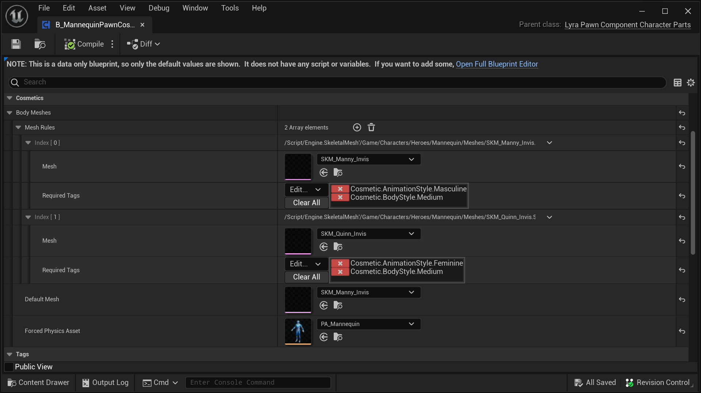
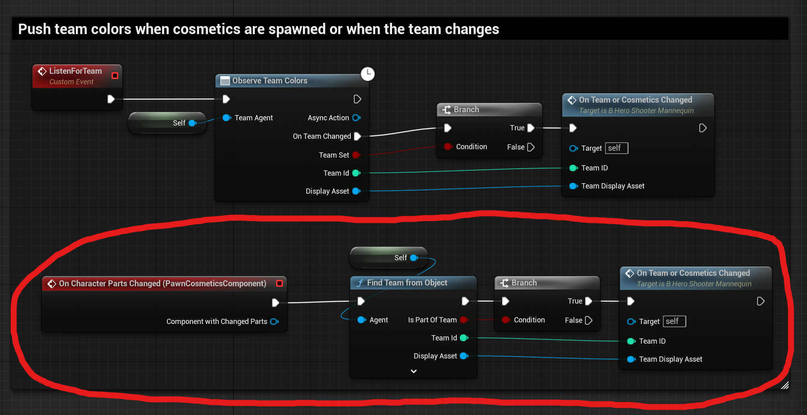

# Lyra Character Parts Pawn Component ("Pawn Customizer")

C++ Class: `ULyraPawnComponent_CharacterParts`
( Lyra 5.2
 [header](https://github.com/EpicGames/UnrealEngine/blob/5.2/Samples/Games/Lyra/Source/LyraGame/Cosmetics/LyraPawnComponent_CharacterParts.h)
|
 [cpp](https://github.com/EpicGames/UnrealEngine/blob/5.2/Samples/Games/Lyra/Source/LyraGame/Cosmetics/LyraPawnComponent_CharacterParts.cpp)
)

This is one part of the [Lyra Character Parts](/UE5/LyraStarterGame/CharacterParts/) system,
see that page for an overview.

## Conceptual Overview

The Character Parts Pawn Component is generally referred to as the "Pawn Customizer".

It is used by the related [Controller Component](./ControllerComponent)
to handle replication to remote clients from the server.

The Pawn Customizer implements the `On Character Parts Changed` event,
which you must hook into in your Character to look for parts being added or removed.
For example see the [Character Integration](#CharacterIntegration)
section below.

**There must be only one Pawn Customizer Component on any given Pawn.**

### Character Part Actors are NOT Spawned on Dedicated Servers

For server efficiency, purely cosmetic actors (Character Parts)
**are NOT spawned on dedicated servers**.

There is exactly zero reason for a dedicated server to spawn and manage
a bunch of cosmetic actors that nobody will ever see.  So it is not done.

The code that enforces this is `FLyraCharacterPartList::SpawnActorForEntry`
in case you want to read through it.  It explicitly refuses to spawn
Character Part cosmetics on a dedicated server.

This may cause confusion if you are trying for example to iterate
the cosmetic actors after a call to `GetCharacterPartActors`.
On clients this will return an array of actors.
On servers this will return an empty array,
because there are no cosmetic actors on a dedicated server.

### How Lyra Sets This Up

- The `B_MannequinPawnCosmetics` Blueprint is based on the `ULyraPawnComponent_CharacterParts` C++ class
    - `B_Hero_ShooterMannequin` adds a `B_MannequinPawnCosmetics` component named `PawnCosmeticsComponent`

Thus, every Lyra character based on `B_Hero_ShooterMannequin` has a Pawn Customizer Component.

## Quick Look: `B_MannequinPawnCosmetics`

Lyra implements a Pawn Customizer Component in Blueprint: `B_MannequinPawnCosmetics`

They then add this `B_MannequinPawnCosmetics` component to the `B_Hero_ShooterMannequin`
Character class.

Here you can see the interesting (non-default) part of `B_MannequinPawnCosmetics`,
where the two default Lyra body types are defined:

## You can make your own component

You can make your own Pawn Customizer Component that defines the settings you want to use.
You don't necessarily have to use the Lyra defaults.

Just make sure that you add your own Pawn Component to your Character,
replacing the Lyra default `B_MannequinPawnCosmetics`.

### Make sure you Integrate with your Character

If you do make your own component, make sure you integrate it with your Character.

For example, see this Blueprint snippet, where the default `B_Hero_ShooterMannequin` blueprint
hooks into the default `B_MannequinPawnCosmetics` event `OnCharacterPartsChanged`.

You will want to hook into your own custom component rather than the default Lyra component
if you replace the Lyra default with a custom version.

#### `B_Hero_ShooterMannequin` hook into `On Character Parts Changed`

## Implementation Detail: `FLyraCharacterPartList`

A lot of the work in the Pawn Customizer Component is actually offloaded to a
dedicated C++ struct called `FLyraCharacterPartList`.

The main purpose of splitting out this struct is to implement network replication.
