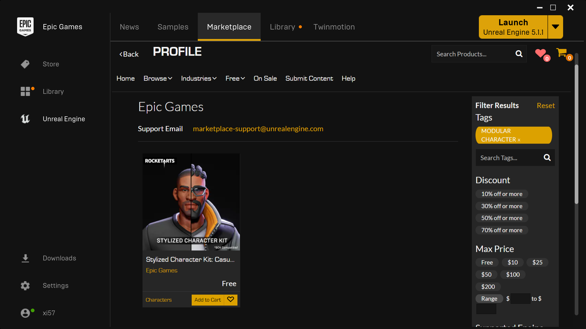

# Lyra Character Parts

For more info, check out my video [UE5 Lyra: Character Parts Overview](https://youtu.be/PYZmQPkvY5M)
covering this topic.

Lyra's Character Parts system is inspired by Fortnite.
The Character Parts are **purely cosmetic**, which allows for some nice efficiencies
in multiplayer games.  For example, the server can mostly ignore the cosmetics, and a local player's
own cosmetics can be much more detailed (and thus expensive) than a remote player's cosmetics.

You don't necessarily have to implement all of this optimization in your early game development,
but using the Lyra Character Parts system will give you the ability to add this later when your
game is a huge success that warrants these optimizations.

In general, the main Lyra Character mesh is invisible.
What you see as the visible Character is a "Character Part", which is purely cosmetic.
You can modify this so a Character is comprised of multiple parts if you prefer,
to easily support fully modular characters.

## Conceptual Overview

- [Character Part](./CharacterPart)
  - a single cosmetic part
    - could be the full body mesh
    - could be just the head, or just the torso, etc
  - Character Part [Gameplay Tags drive the Character Animation Style](./CharacterPart#Animation)
- [Controller Component](./ControllerComponent)
  - determines which parts will be added to the controller's pawn
  - injected into **all** Controllers on the server, Player and Bot alike
    - only present on the **Server**
- [Pawn Component](./PawnComponent) (AKA "Pawn Customizer")
  - handles replicating the controller-chosen parts to clients
  - actually spawns the character part actors *(on clients only)*
  - present on server and **all** clients, including remote clients

## Vanilla Lyra Configuration

By default in Lyra 5.2 there are only 2 cosmetic components: `B_Manny` and `B_Quinn`

The Lyra server chooses randomly between Manny or Quinn
after the Controller `BeginPlay` and replicates the decision to all clients.
The clients handle spawning the actual parts themselves.

The server uses an invisible Character mesh regardless of
how many cosmetic parts there are or what they look like.

### Differences Between Client and Server Contexts

The [Controller Component](./ControllerComponent) determines which parts will be present
for any given Pawn.  This exists only on the Server (for all Players),
due to the injection setup limiting it to server-only.
It does not exist on any client.

The [Pawn Component](./PawnComponent) is responsible for actually spawning the actor
that represents any given Character Part, based on settings replicated to it by the server.

**It does not spawn cosmetic components on a dedicated server.**

This is worth repeating.
The server **does not** spawn cosmetic character part actors.
**ONLY clients** spawn the cosmetic character part actors.

The reason for this is that nobody is sitting on the server looking at its display.
Thus there is no reason at all to spawn and process actors that are purely cosmetic.
This is a server efficiency optimization.

If you run a server in Listen Server mode (e.g. there is a Local Player sitting at their
PC hosting a game for others to join) then the server DOES spawn cosmetic components
for the benefit of the Local Player.
However, in a Dedicated Server, where the server is handling a Remote Player client,
no cosmetic Character Part actors are spawned.

## Content Used

You can obviously use your own content, but here is the free stuff I used:

- Lyra 5.2+
- [Stylized Character Kit: Casual 01](https://www.unrealengine.com/marketplace/en-US/product/stylized-male-character-kit-casual) from the Epic Games Marketplace

### Free Marketplace Asset: "Stylized Character Kit: Casual 01"

This content pack is currently free on the Epic Games Marketplace (it has been free for quite a while, so I hope
it will always be free).

# References

- [Official Epic Video: Building Modular Characters in Unreal Engine (Unreal Fest 2022)](https://youtu.be/7IUpa3Pxqug)
- [Official Epic Docs: Modular Characters in UE5](https://docs.unrealengine.com/5.0/en-US/modular-characters-in-unreal-engine/)

