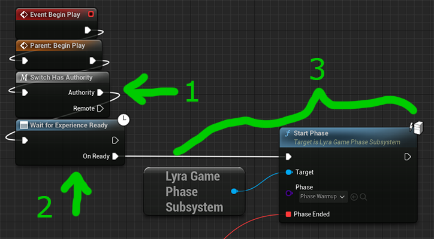

# Lyra Game Phase Subsystem

*Copy/Paste from C++ comments:*

Subsystem for managing Lyra's game phases using gameplay tags in a nested manner, which allows parent and child
phases to be active at the same time, but not sibling phases.

Example: `Game.Playing` and `Game.Playing.WarmUp` can coexist,
but `Game.Playing` and `Game.ShowingScore` cannot.

When a new phase is started, any active phases that are not ancestors will be ended.

Example: if `Game.Playing` and `Game.Playing.CaptureTheFlag` are active when `Game.Playing.PostGame` is started,
`Game.Playing` will remain active, while `Game.Playing.CaptureTheFlag` will end.

### Debugging Tips

- Enable `LogLyraGamePhase` logging

# Lyra Game Phase Ability

Each Game Phase is represented by a Gameplay Ability.  The base C++ class is `ULyraGamePhaseAbility`.

You must assign a Game Phase Tag, which is a Gameplay Tag that represents this phase, for example `Game.Playing`.
This tag determines which other abilities get cancelled when this phase begins.

When the ability is activated, it executes `ULyraGamePhaseSubsystem`🡒`OnBeginPhase` just before it
actually activates.  This causes previous phases to end as needed just before the new phase activates,
based on their Game Phase Tag.

When the ability is ended, it executes `ULyraGamePhaseSubsystem`🡒`OnEndPhase` just before ending.

# Phase Transitions

To transition to a particular game phase, call `ULyraGamePhaseSubsystem`🡒`StartPhase` and pass it
the Lyra Game Phase Ability representing the game phase you wish to start.

`StartPhase` will grant the game phase ability to the Game State's Ability System Component and activate it.

For example in Lyra's `ShooterCore`, the `B_ShooterGame_Elimination` Experience Definition
injects a `B_TeamDeathMatchScoring` component into the Game State.
Amongst other things, that game state component hooks into `BeginPlay`,
then waits for the Experience to load and finally starts the `Phase_Warmup` game phase.

You can optionally specify a callback to be executed when the phase ends.

When the `Phase_Warmup` phase is activated, it does the necessary stuff to begin the period of waiting
for other players to join, etc.  It then transitions to `Phase_Playing` when needed.

The general idea is that each Game Phase Ability handles transitioning from one
phase to the next as appropriate.  The Game State itself determines which phase is started
when the game starts (as configured by the Lyra Experience via component injection).
