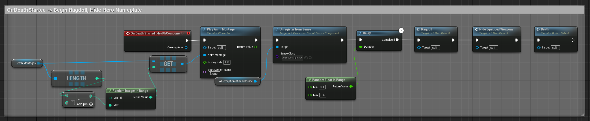
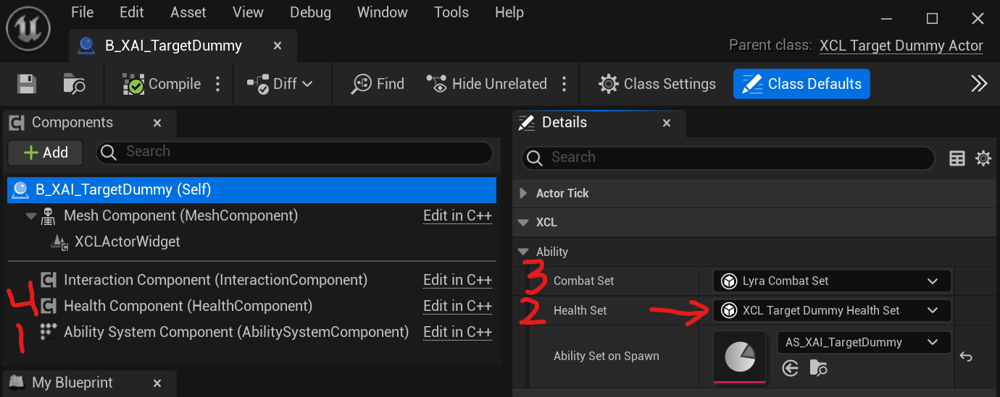

# UE5 Lyra Health and Damage

At its core, Lyra's Health and Damage system is based on the Gameplay Ability System (GAS).

Even if you choose not to use Lyra, if you use GAS, giving your actors health and dealing
damage or healing to them is going to be very, very similar to how it is done in Lyra.

In a Lyra game, any actor/pawn/character that wants to have health and potentially be damaged or healed
MUST have a valid, correctly initialized `AbilitySystemComponent` (ASC)
and MUST have a `LyraHealthSet` GAS attribute set.

While the `LyraCombatSet` is technically optional and defaults to zero values, if the actor
does not explicitly have a `LyraCombatSet`, Lyra will complain loudly via warning log messages.
Thus, a `LyraCombatSet` is practically required as well, if for no reason other than to
squelch the warning messages. (If you duplicate/refactor the Lyra Damage/Heal Calculations,
you can remove the requirement for a combat set if you prefer).

Therefore by default in Lyra, to give an actor/pawn/character health, so you can damage or heal it, your actor must have:

- Lyra ASC (`ULyraAbilitySystemComponent`)
  - Allows the actor to participate in GAS
- Lyra Health Set (`ULyraHealthSet`)
  - Defines the actor's health attributes
- Lyra Combat Set (`ULyraCombatSet`)
  - Defines the actor's combat capabilities (base healing and damage values)

And though it is not strictly required, another useful component to add:

- Lyra Health Component (`ULyraHealthComponent`)
  - Makes it easier to read health info and handle health change events in Blueprints

## Lyra Character as an Example

By default, Epic has built out the base `ALyraCharacter` class such that it has an ASC,
a Health Set and a Combat Set.  Thus working with Characters is very easy as long as you base
your character on `ALyraCharacter`.

The `ALyraCharacter` is fairly complex and so it doesn't make a great example to show off
how health and damage specifically work in Lyra.

Epic also provided a C++ class `ALyraCharacterWithAbilities` that is not used in any official Lyra
code, but they did use it to make a target dummy to test Lyra weapons on.  However, ultimately
this is still a Character, and it's based on `ALyraCharacter`, so again, it does not make a
very clear example.

# XCL Actor with Abilities

In my `XCL` plugin I've made a class `AXCLActorWithAbilities`.  This was inspired by Lyra's
`ALyraCharacterWithAbilities`.

The XCL Actor with Abilities is the simplest possible example of an actor that can participate
in GAS.

It does not have any health information.  It cannot be damaged or healed.  It does have
an ASC, so you can give it abilities or attributes as needed.

Why would you want this?  Maybe you want some actor in the world that doesn't have any health,
but it still has abilities.  Maybe this is an in-game interactive computer terminal.  You want
to be able to use it, but not kill it.  This would be your base for such an actor.

# XCL Actor with Abilities and Health

The next step then is to take an XCL Actor with Abilities and add a Health Set, a Combat Set
and an optional but useful `ULyraHealthComponent` to it.

We derive from XCL Actor with Abilities, and we add these components, and the result is
`AXCLActorWithAbilitiesAndHealth`.

Now this actor has health and combat capabilities.  You can heal it or damage it by applying
GAS Gameplay Effects.  If you damage it enough, it will die.

## How do I Damage it !?

To damage the actor, apply a Gameplay Effect that increases the `Damage` attribute
of the actor's `HealthSet`.  When it executes, it will decrease the `Health` by the `Damage`
amount (down to a minimum of zero).

An example Gameplay Effect that damages an actor is `GE_Damage_Basic_Instant`.

For more details, see `GE_Damage_Basic_Instant` and read the code for `ULyraDamageExecution`
which is what actually applies the damage effect in Lyra.

## How do I Kill it !?

At zero health, the Health Set will fire off its `OnOutOfHealth` event.

**It is your responsibility to listen for this event and kill off your actor.**

Because we added the optional but useful `ULyraHealthComponent` to our actor,
it hooks into the `OnOutOfHealth` event and translates it into a series of related,
derivative events:

- A `GameplayEvent.Death` Gameplay Event is sent to the now-pending-death Actor's ASC
- A `Lyra.Elimination.Message` message is broadcast to the Gameplay Message Subsystem
  - This includes info like which actor died and who killed them

Note that there are some TODO notes in the `ULyraHealthComponent` with some ideas for how
those events could be improved.  You may be interested to do some of that, or add your
own logic there instead.

In Lyra, player and AI characters are injected with the `GA_Hero_Death` ability on spawn.
This ability triggers on `GameplayEvent.Death` events related to its owning actor, and
calls `HealthComponent`🡒`StartDeath`, which initiates the procedure of killing the actor.

Listen for the Health Component's `OnDeathStarted` event, and start to kill your actor/pawn/character
when that event fires.  By the time `OnDeathFinished` fires, the actor should be dead, as it is
being forcefully removed from the world probably on the next tick.

Lyra listens for this component's event in its `B_Hero_Default` (one of the Lyra Character
base BPs) event graph.

For more info RE `B_Hero_Default`'s handling of the Health Component's `OnDeathStarted`
event, and Lyra's base characters in general, see
[Deep Dive: Lyra’s Shooter Mannequin](/UE5/LyraStarterGame/ShooterMannequin).

###### Lyra's `B_Hero_Default` Event Graph

## How do I Heal it !?

To heal the actor, apply a Gameplay Effect that increases the `Healing` attribute
of the actor's `HealthSet`.  When it executes, it will increase the `Health` by the `Healing`
amount (up to `MaxHealth`).

An example Gameplay Effect that heals an actor is `GE_Heal_Instant`.

For more details, see `GE_Heal_Instant` and read the code for `ULyraHealExecution` which
is what actually applies the healing effect in Lyra.

# Example Code

I've published some example code to help with this.  This code WILL NOT COMPILE.
The point is not for this to be plug and play for you.  The point is to be an example
of how you can do this yourself.

- [
[h](https://github.com/x157/Lyra-ActorWithAbilities/blob/main/Source/XCL/XCLActorWithAbilities.h)
|
[cpp](https://github.com/x157/Lyra-ActorWithAbilities/blob/main/Source/XCL/XCLActorWithAbilities.cpp)
]
`AXCLActorWithAbilities`
- [
[h](https://github.com/x157/Lyra-ActorWithAbilities/blob/main/Source/XCL/XCLActorWithAbilitiesAndHealth.h)
|
[cpp](https://github.com/x157/Lyra-ActorWithAbilities/blob/main/Source/XCL/XCLActorWithAbilitiesAndHealth.cpp)
]
`AXCLActorWithAbilitiesAndHealth`
- [
[h](https://github.com/x157/Lyra-ActorWithAbilities/blob/main/Source/XCL/XCLTargetDummyHealthSet.h)
|
[cpp](https://github.com/x157/Lyra-ActorWithAbilities/blob/main/Source/XCL/XCLTargetDummyHealthSet.cpp)
]
`UXCLTargetDummyHealthSet`
- [
[h](https://github.com/x157/Lyra-ActorWithAbilities/blob/main/Source/XCL/XCLTargetDummyActor.h)
|
[cpp](https://github.com/x157/Lyra-ActorWithAbilities/blob/main/Source/XCL/XCLTargetDummyActor.cpp)
]
`AXCLTargetDummyActor`

As described here, `AXCLActorWithAbilities` and `AXCLActorWithAbilitiesAndHealth` should pose no
surprises at all.

`UXCLTargetDummyHealthSet` is a simple derivation of `ULyraHealthSet` with the only difference being
that I never allow the `Health` attribute to drop below `1`.  In this way, the Target Dummy will
never die, and I can hit it as many times as I want.

`AXCLTargetDummyActor` is a derivation of `AXCLActorWithAbilitiesAndHealth`.  It adds a skeletal mesh
and it defines the override of `UXCLTargetDummyHealthSet` in the `ObjectInitializer` that it passes
to its `Super` (`AXCLActorWithAbilitiesAndHealth`).

Thus, the Target Dummy has health and can be damaged and healed, but it can never die, because
of the special overridden Health Set it uses which does not allow Health to drop to zero.

# What this looks like in Editor

Red numbers highlight the vital components:

1. Ability System Component
2. Health Set 
3. Combat Set
4. Health Component

The Health Set has a red arrow showing that the default value is the `XCL Target Dummy Health Set`,
which is as we expect given the code.

There are a few things you see here that aren't in the example.
These do not affect damage or healing:

- The `XCLActorWidget` is the health bar widget in the video example.
- The `Interaction Component` is an XCL Interaction Component which allows the player of my game to interact with this actor.

The `AS_XAI_TargetDummy` asset shown there is a Lyra Ability Set.  The only thing defined there
is a Gameplay Effect that is a periodic +20 Health/second heal.  That way when I send my Target Dummy
down to `1` HP, it fully regenerates in 5 seconds.

# Summary

You have a HUGE amount of control over how these calculations are done and what the resulting
values are.  To exercise this control, you must learn GAS, in particular:
Gameplay Attributes and Gameplay Effects.

Gameplay Attributes are what defines the actor's health (or shields, or mana, or whatever),
and Gameplay Effects are how you modify those values during game play.

In reality, Attributes can contain **way more info** than just the health.

Making something "be alive" is only the beginning.  `:-)`
