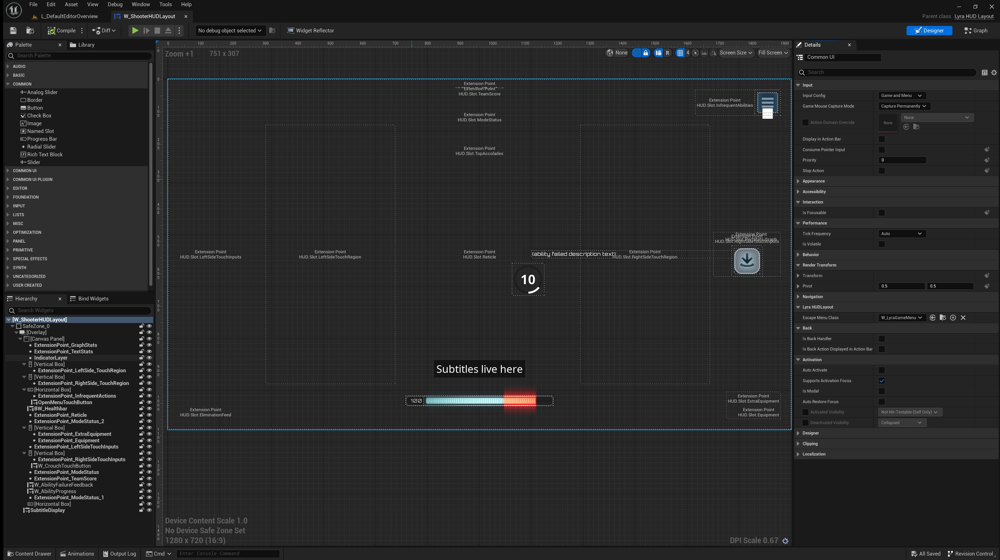
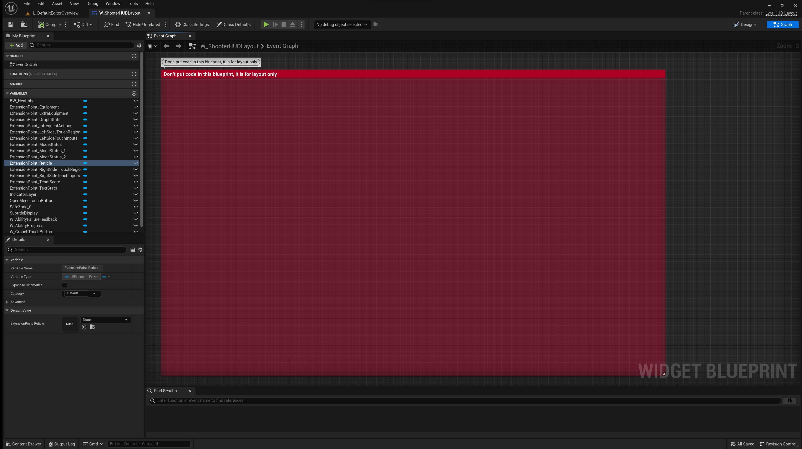

# Lyra HUD Layout

The Lyra HUD Layout Widget is intended to implement the root widget of an
[Activatable Widget](/UE5/CommonUI/ActivatableWidget) Container Layer
as defined by the
[Lyra UI Policy](./UIPolicy).

- This widget is **purely for Layout** purposes
- Allows big-picture placement and coordination of HUD elements
  - Defines [UI Extension](/UE5/UIExtension/) points and how they relate to one another, visually and hierarchically
  - **SHOULD NOT CONTAIN Blueprint Logic**, events, functions or variables.  **LAYOUT ONLY**.
- Is a Lyra [Activatable Widget](/UE5/CommonUI/ActivatableWidget)
  - Returns Lyra-specific settings for `Get Desired Input Config`
    - You may want to override this method for your own project to support your own input style
- Handles `Escape` key presses opening the Game Menu
  - Input mode seemingly must be in either `Game+UI` or `Menu` for this to work

## Example Lyra HUD Layout

`W_ShooterHUDLayout` from the `ShooterCore` GFP:

As you can see, **Layout ONLY**, no code!

