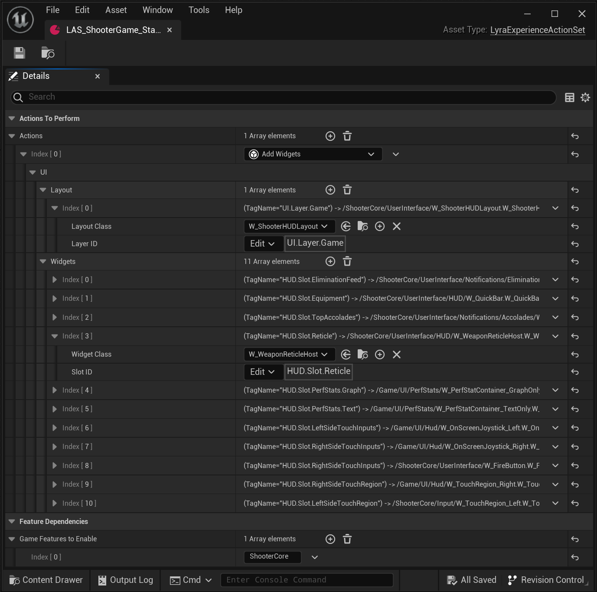

# `LAS_ShooterGame_StandardHUD`

This is an example Game Feature Action
instantiation of a [Lyra HUD Layout](./HUDLayout)
in the `ShooterCore` GFP.

When loading the `ShooterCore` experiences, they list this Lyra Experience Action Set as one
of the Game Feature Actions to execute.

When the `Add Widgets` Game Feature Action executes, it:

- Pushes a new `W_ShooterHUDLayout` widget (a [Lyra HUD Layout](./HUDLayout)) onto the `UI.Layer.Game` UI Layer
- Creates appropriate widgets for each various `HUD.Slot.*` UI Extension Point, including:
  - `W_WeaponReticleHost` for the `HUD.Slot.Reticle` slot

### Lyra 5.2 Screenshot

