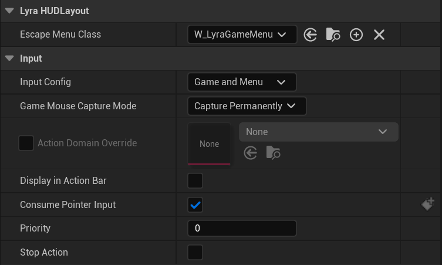

# Lyra Input Overview


<a id='KeyConcepts'></a>
## Key Concepts

- [Common UI](/UE5/LyraStarterGame/CommonUI/) manages input mode changes during gameplay
  via [Common UI Action Router](/UE5/CommonUI/ActionRouter)
- [Enhanced Input](/UE5/EnhancedInput/) receives all input that is directed to the game,
  filtered by active [Input Mapping Contexts](/UE5/EnhancedInput/InputMappingContext)
- [Lyra HUD Layout](/UE5/LyraStarterGame/Input/HUDLayout) integrates Common UI with Enhanced Input
  - is a [Activatable Widget](/UE5/CommonUI/ActivatableWidget)
  - [UI Extension](/UE5/UIExtension/) provides UI Extension Point Widgets


### Quick Links

- [Input Handling Overview](#InputHandlingOverview)
- [Input Mapping Contexts](#IMC)
- [Lyra Hero Component](#LyraHeroComponent)
- [Lyra Project Settings](#ProjectSettings)
- [References](#References)
- [Example HUD Settings](#ExampleHUDSettings)


<a id='InputHandlingOverview'></a>
## Input Handling Overview

Lyra uses [Enhanced Input](/UE5/EnhancedInput/)
together with [Common UI](/UE5/CommonUI/)
to manage Player Input.
Be familiar with both.

These UE5 plugins are integrated via
[Lyra HUD Layout](/UE5/LyraStarterGame/Input/HUDLayout),
which defines a HUD as being comprised of prioritized layers of
[Activatable Widgets](/UE5/CommonUI/ActivatableWidget).

The `Escape` key (the "back" button) activates the Game Menu widget,
which suspends Player Game Input while the menu is open, for example.

The Lyra HUD controls if, when and how input makes it to the Game.
This is all managed by [Common UI](/UE5/CommonUI/).
If/when you want to explicitly change input modes in your Game,
you must use the [Common UI Action Router](/UE5/CommonUI/ActionRouter) to do so.

When [Activatable Widgets](/UE5/CommonUI/ActivatableWidget) activate and deactivate,
they can optionally change the input mode and/or focus themselves for input
to support MKB, Gamepad, VR controllers, etc.
The settings are all customizable by input device and platform.

When no Activatable Widget is modifying the input mode, the inputs all go to
the Game itself via [Enhanced Input](/UE5/EnhancedInput/).


<a id='IMC'></a>
### Input Mapping Contexts (IMC)

[Input Mapping Context](/UE5/EnhancedInput/InputMappingContext)
management during Gameplay allows you to activate or deactivate any
given IMC based on the context.
For example, possessing a Vehicle or ejecting from it might change the active IMC
compared to movement on foot.

Lyra uses Game Feature Actions to initialize default IMCs, and you can add your own
IMC swapping logic to dynamically change inputs during Gameplay.


<a id='LyraHeroComponent'></a>
## Player Input is managed by the Lyra Hero Component

The Lyra Hero Component activates the Native & Ability Input Actions for the Player Pawn.

- For a pawn to receive player input, it **must** have a `ULyraHeroComponent` component
  - If you want custom input handling, you **must** derive from `ULyraHeroComponent`
    - `ULyraHeroComponent` as a base class is required by Lyra, including but not limited to:
      - `ULyraGameplayAbility`
        - To manage ability camera modes
        - Also exposes the Hero Component to BPs that may use it for other reasons
      - Game Feature Actions having to do with input management:
        - `GameFeatureAction_AddInputBinding`
        - `GameFeatureAction_AddInputConfig`
        - `GameFeatureAction_AddInputContextMapping`
- `ULyraHeroComponent` works in conjunction with `ULyraPawnExtensionComponent` to activate the inputs on the pawn
  - Thus, the pawn must also have a `ULyraPawnExtensionComponent` and fully support the `IGameFrameworkInitStateInterface`
  - See `ULyraHeroComponent`::`InitializePlayerInput` for implementation details
    - This gets called during the pawn initialization process while transitioning to `InitState.DataInitialized`
  - This requires the player to be using `ULyraInputComponent` for input, which is configured in the [Project Settings](#ProjectSettings)


<a id='ProjectSettings'></a>
# Lyra Project Settings

`Config/DefaultInput.ini` defines (amongst other things):

```ini
[/Script/Engine.InputSettings]
DefaultPlayerInputClass=/Script/EnhancedInput.EnhancedPlayerInput
DefaultInputComponentClass=/Script/LyraGame.LyraInputComponent
```

- Enables Enhanced Input
- Sets `ULyraInputComponent` as the player's input component (it is derived from `UEnhancedInputComponent`)


<a id='References'></a>
# References

- [Official Epic Lyra Input Docs](https://docs.unrealengine.com/5.1/en-US/lyra-input-settings-in-unreal-engine/)
- [ULyraSettingsLocal](/UE5/LyraStarterGame/ULyraSettingsLocal)


# Examples

<a id='ExampleHUDSettings'></a>
## Example HUD Settings

This is one of the HUD Layouts that I use:



