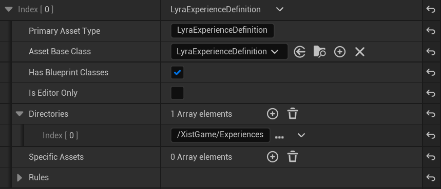
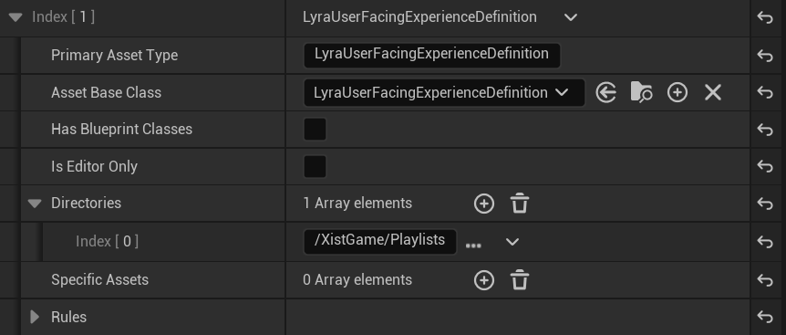
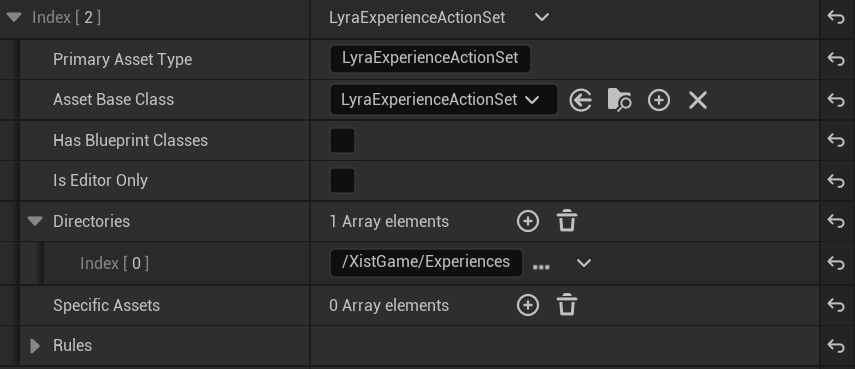
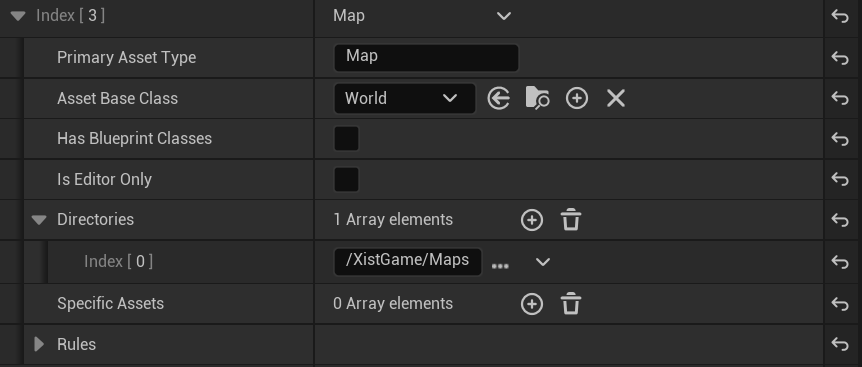
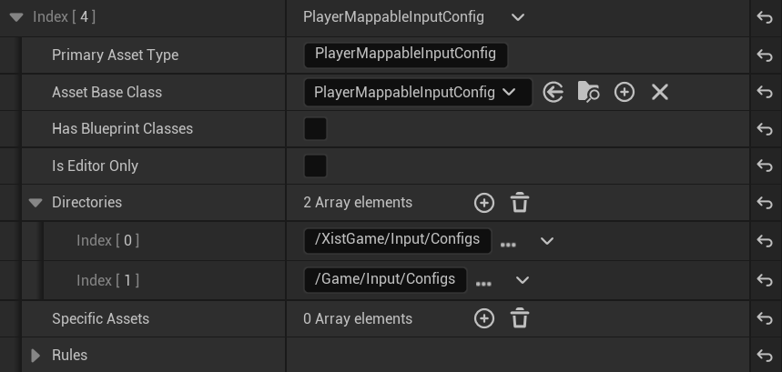

# Configuring AssetManager

In order for Lyra to be able to load your plugin's files, you need to tell AssetManager where to look for them.

Some files you will hard reference, but others are soft references that require a search path to be found.


## Configure AssetManager in YourGame.uasset

Open `Plugins/YourGame/Content/YourGame.uasset` (your plugin's primary Data Asset file).

Near the bottom there is a section for `AssetManager` and under that for `Primary Asset Types to Scan`

You need to ensure there is an entry for each of the following data types:

In these examples my GameFeature Plugin is named `XistGame`


### If you just want to import this rather than entering by hand:

Copy this text and right-click-paste it onto the `Primary Asset Types to Scan` array:
```text
((PrimaryAssetType="LyraExperienceDefinition",AssetBaseClass="/Script/LyraGame.LyraExperienceDefinition",bHasBlueprintClasses=True,Directories=((Path="/XistGame/Experiences"))),(PrimaryAssetType="LyraUserFacingExperienceDefinition",AssetBaseClass="/Script/LyraGame.LyraUserFacingExperienceDefinition",Directories=((Path="/XistGame/Experiences/Playlists"))),(PrimaryAssetType="LyraExperienceActionSet",AssetBaseClass="/Script/LyraGame.LyraExperienceActionSet",Directories=((Path="/XistGame/Experiences"))),(PrimaryAssetType="Map",AssetBaseClass="/Script/Engine.World",Directories=((Path="/XistGame/Maps"))),(PrimaryAssetType="PlayerMappableInputConfig",AssetBaseClass="/Script/EnhancedInput.PlayerMappableInputConfig",Directories=((Path="/XistGame/Input/Configs"),(Path="/Game/Input/Configs"))))
```


### LyraExperienceDefinition




### LyraUserFacingExperienceDefinition




### LyraExperienceActionSet




### Map



*Note: The title of the above should be "Map" which is consistent with the other Lyra code.*


### PlayerMappableInputConfig




# Next Step: Add Gameplay Cue Path

[Add Gameplay Cue Path](./GameFeatureData-AddGameplayCuePath)
or go back to [Lyra Starter Game](/UE5/LyraStarterGame/)
