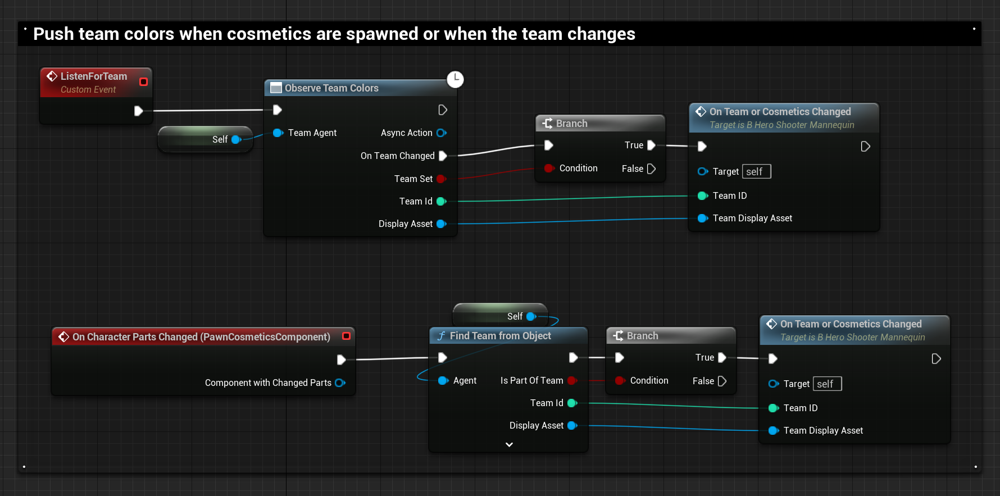
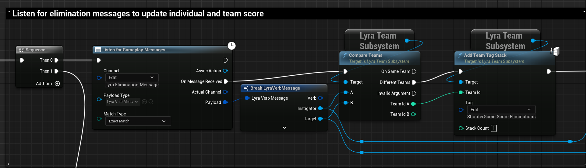
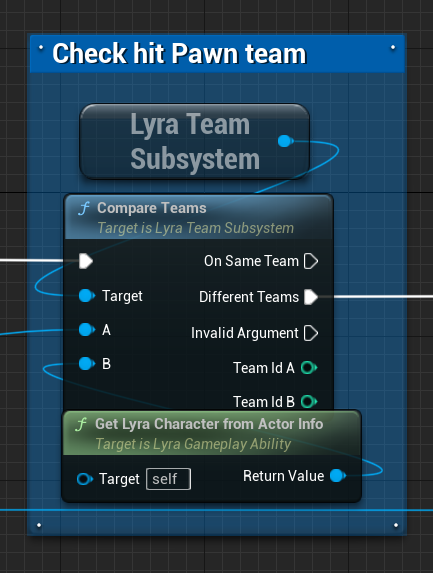

# Lyra Team System

[Lyra](/UE5/LyraStarterGame/) ships with a reasonably featured Team System,
the core of which is the [Lyra Team Subsystem](./LyraTeamSubsystem).

## Conceptual Overview

**Note: Teams do not exist outside a given Lyra [Experience](/UE5/LyraStarterGame/Experience/)**.
This is yet another reason why you must correctly use
[`On Experience Loaded`](/UE5/LyraStarterGame/Experience/#OnExperienceLoaded)
throughout your Lyra project.

Team-based Actors in your game must implement
[Lyra Team Agent Interface](./LyraTeamAgentInterface)
to be team-aware.  Lyra Characters, Player Controllers and Player States
all implement this interface, for example.

By default, friendly fire is disabled and teams can only be categorized as either
"same team" or "different team" relative to one another,
but this is easy to change in C++.

The Team Subsystem is typically initialized in Lyra via a Game Feature Action
*(instantiated in the [Experience Definition](/UE5/LyraStarterGame/Experience/#LyraExperienceDefinition))*
by injecting a [Lyra Team Creation Component](./LyraTeamCreationComponent) into the Game State.
For example, the quintessential Lyra Red vs Blue `B_TeamSetup_TwoTeams` in the example `ShooterCore` GFP.

### Components of the Lyra Team System

- [Lyra Team Agent Interface](./LyraTeamAgentInterface)
- [Lyra Team Creation Component](./LyraTeamCreationComponent) *(Game State Component)*
- [Lyra Team Display Asset](./LyraTeamDisplayAsset)
- [Lyra Team Info](./LyraTeamInfo)
- [Lyra Team Subsystem](./LyraTeamSubsystem)
- Async Actions to listen for Team Changes on a given Actor
- Static Blueprint Helper functions (`ULyraTeamStatics`)
- Dev Cheats to set one's team

## How to Set or Change Teams

By default, there are only 2 ways a team might be assigned to an Actor in Lyra:

1. When the Player joins the Game
    1. via the `OnGameModePlayerInitialized` delegate in `ULyraGameMode`
        - Team is assigned to the Player State and is thus inherited by related Actors
2. By explicitly calling [`ULyraTeamSubsystem`](./LyraTeamSubsystem)::`ChangeTeamForActor`
    - to change a Player's team, call this on their Player State

Generally nothing in Lyra explicitly changes teams using the subsystem
except for the Dev Cheat, but you can call it in your game whenever
you want to allow players to change teams.

Also note that Lyra does most things using the Player State, and Teams are no different.
If you want to change a player's team, you change the team of their Player State.
Doing so will broadcast a team change message on the Player State and their Controller,
Pawn, etc, will update accordingly.

## Lyra Examples

### Mannequin Team Cosmetics

In the `B_Hero_ShooterMannequin` BP from `ShooterCore`:
- the `Observe Team Colors` async action listens for team change events for the pawn
  - Sets up team colors and cosmetics based on the new team
- the `Find Team from Object` node determines what team the pawn is currently on any time cosmetics are changed
  - Sets up team colors and cosmetics based on the current team

### Team Elimination Scoring

In the `B_ShooterGameScoring_Base` Blueprint, team elimination stats are updated
whenever someone dies.  The instigator's team gets awarded an elimination point:

### Melee: Only Damage Pawns on Other Teams

In the `GA_Melee` ability, damage is only applied to hit pawns if they're on
a different team from the one executing the melee ability:

