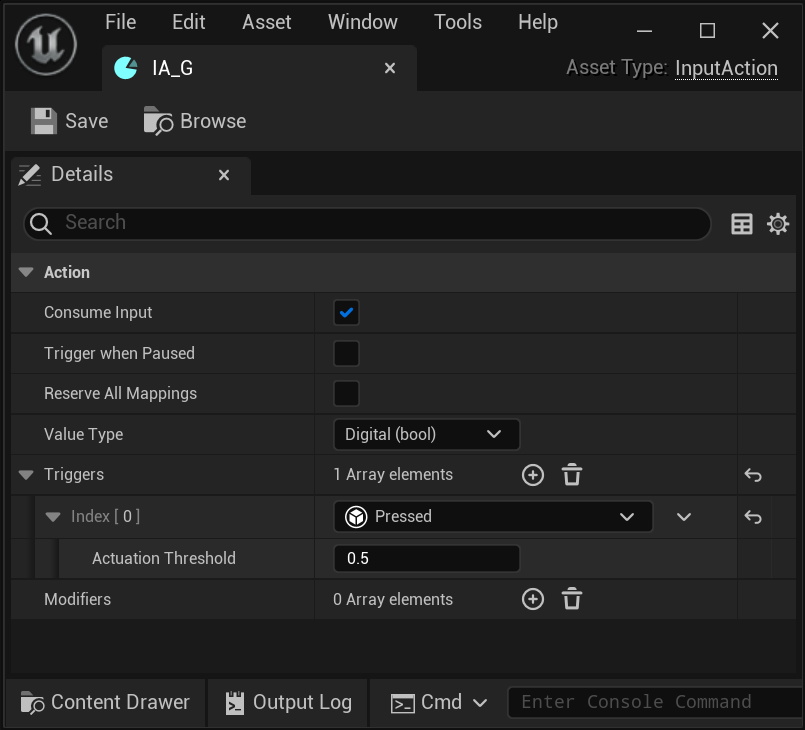
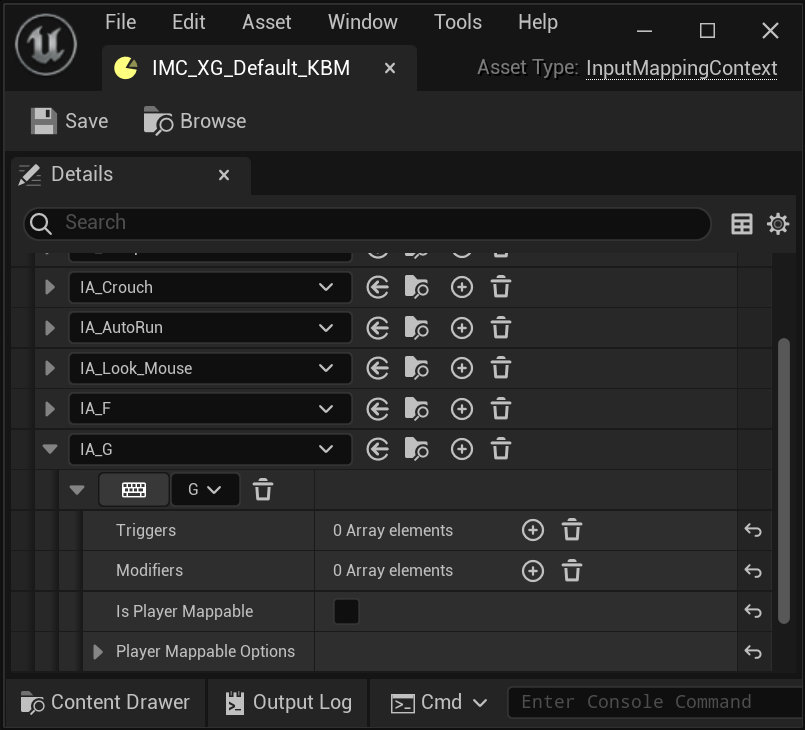
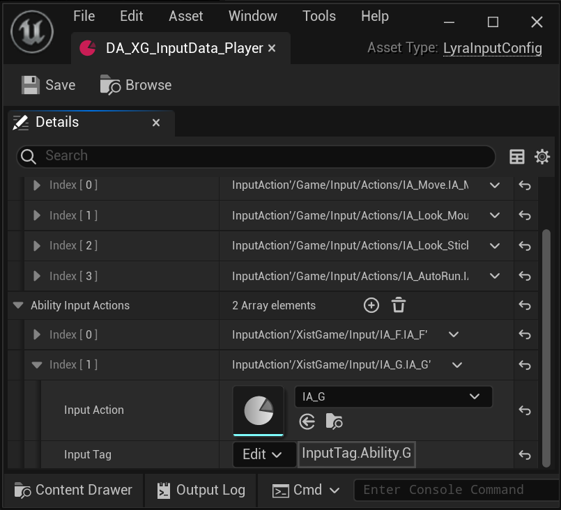
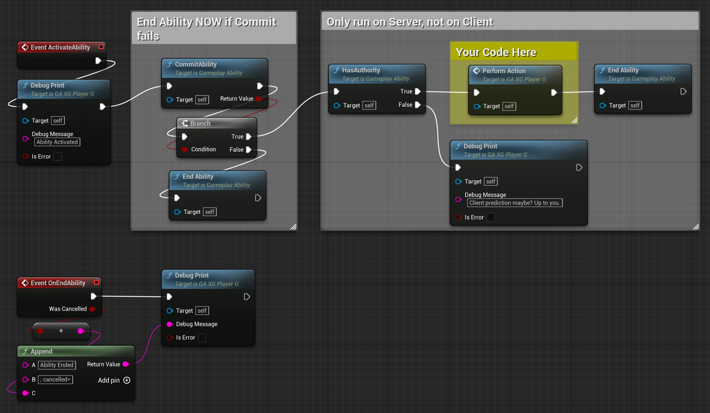
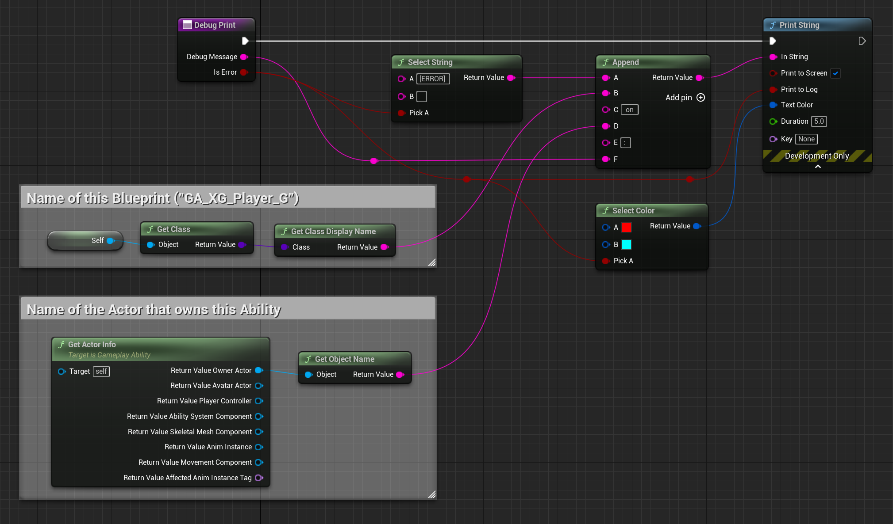
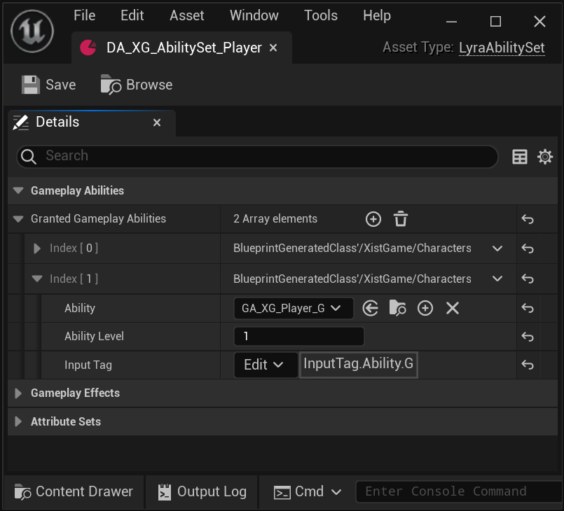
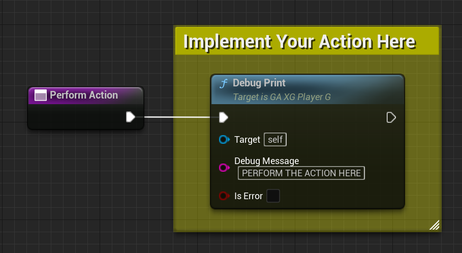

# How To: Create a New Gameplay Ability

For this tutorial we're going to make a new ability that executes each time the player presses the keyboard `G` key.

We will:

- Create new assets:
  - `InputAction` data asset (`IA_G`)
  - `InputTag` Gameplay Tag (`InputTag.Actions.G`)
  - `LyraGameplayAbility` blueprint (`B_XG_Player_G`)
- Connect these assets to Lyra:
  - Map keyboard to `InputAction`
  - Map `InputAction` to `InputTag`
  - Map `InputTag` to `LyraGameplayAbility`

The end result will be: Pressing keyboard `G` will cause our `LyraGameplayAbility` to execute.

Prefer video?  If so jump over to my [YouTube tutorial video](https://youtu.be/4C-2JiyJft8) covering this topic.

*Note: The naming convention here is not going to be ideal because this ability is intended only for developer use. For a real ability you'd want to name it something that actually represents what you intend this ability to do. So rather than "Ability G" you'd want to use for example "Ice Trap Ability" or "Shoot Rocket Ability" or whatever, disassociating it with the input required to make the ability happen.*

## 1. Create a New Input Action

Right click in the editor content browser, choose: `Input` > `Input Action`

Name it `IA_G`, configure it as in this screenshot:

## 2. Create new Gameplay Tag

Open Project Settings, click `Project` > `GameplayTags`.

In `Gameplay Tags` > `Gameplay Tag List`, add a new tag.

Name the new tag `InputTag.Ability.G`

## 3. Add Keyboard Mapping

Open the `InputMappingContext` where you want the `G` ability to be active.  Mine is called `IMC_XG_Default_KBM`.

Add `IA_G` to the list of `Mappings` > `Mappings`. Configure it as in this screenshot:

Tip: If you don't know which `InputMappingContext` to modify:
- Open your Map
- Open the Map's Experience
- Look in `Gameplay` > `Action Sets`
  - Open each action set and look for one with an `Add Input Mapping` action.
    - The Input Config listed here is the one you'll want to modify.
    - Keep this open, you'll probably need it in the next step also.

## 4. Map Input Data to Input Tag

Open the `LyraInputConfig` where you want to be able to use the `G` ability.  Mine is called `DA_XG_InputData_Player`.

Add a new `Ability Input Action` (**Ability**, not Native).  Set the Input Action = `IA_G` and set the Input Tag = `InputTag.Ability.G`

Tip: If you don't know which `LyraInputConfig` data asset to modify:
- Open your Map
- Open this Map's Experience definition
- Look in `Gameplay` > `Action Sets`
  - Open each action set and look for one with an `Add Input Binds` action.
    - The Input Config listed here is the one you'll want to modify.

## 5. Create new Lyra Gameplay Ability

Right click on content browser, `Blueprint Class`, in All Classes search for `LyraGameplayAbility`.  I named mine `GA_XG_Player_G`.

Here is the Event Graph:

Here is the `DebugPrint` function, which is not at all important to this demo other than to show you there is nothing magical happening in here:

## 6. Add New Ability to the Player's Ability Set

Open the `LyraAbilitySet` for your player, mine is called `DA_XG_AbilitySet_Player`.

Add the ability we created, associate it with the Input Tag we created.

Configure it like this:

Tip: If you don't know which `LyraAbilitySet` data asset to modify:
- Open your Map
- Open this Map's Experience definition
- Open the Experience's Pawn Data asset
- It will be one of the data assets listed in `Abilities` > `Ability Sets`
  - Mine is called `DA_XG_AbilitySet_Player`

# Congratulations! You've Added a new Gameplay Ability

You've now added a new Gameplay Ability to Lyra, so when you're playing the game and you push the `G` key, this ability will be activated and will run the code you put in its `PerformAction` function.  Put whatever you want there!

In this simple example, my `PerformAction` just calls `DebugPrint`, but you can have yours do whatever you want it to do.

## YouTube Video Tutorial

If you have any issues, particularly finding where the appropriate data assets are that you should be editing, check out my YouTube video tutorial on this topic:

[YouTube Video Tutorial](https://youtu.be/4C-2JiyJft8)

