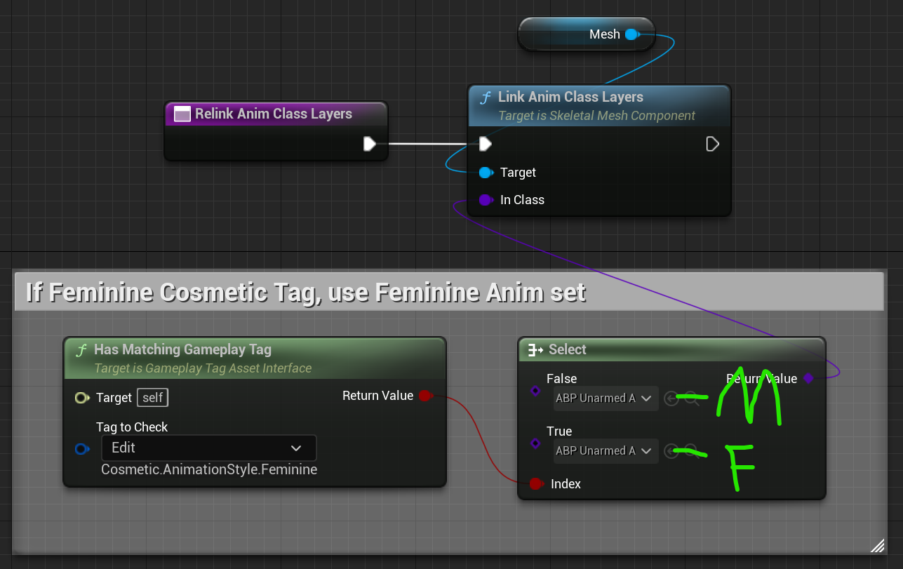

# How To: Fix Lyra's Unarmed Animation Bugs

This very short video shows how to do the fix, which is still necessary even after the 5.0.2 update.

<iframe width="1000" height="564" src="https://www.youtube.com/embed/8qTc2IcG31g" title="YouTube video player" frameborder="0" allow="accelerometer; autoplay; clipboard-write; encrypted-media; gyroscope; picture-in-picture" allowfullscreen></iframe>

## Update: Activating Feminine Animations

The solution in the video will use the masculine version of the unarmed animation,
which works to fix the Lyra errors, but does not correctly apply feminine animations.

To get Quinn using the feminine animations, you need to add 2 additional nodes to the graph as seen here:

Here we check if the character has the `Cosmetic.AnimationStyle.Feminine` Gameplay Tag.

If the tag is present on the character, the `True` part of the `Select` is used.  You can't see it
in the screenshot, but that dropdown is referencing `ABP_UnarmedAnimLayers_Feminine`.
(I marked it with a green `F` in the screenshot.)

If the tag is not present, the config is the same as it was before: `ABP_UnarmedAnimLayers` (the `M` option).

I created this new method `Relink Anim Class Layers` and everywhere else that needed to call the
blue `Link Anim Class Layers` node before was updated to call the purple `Relink Anim Class Layers`
method that applies the correct layer based on the character body type.
