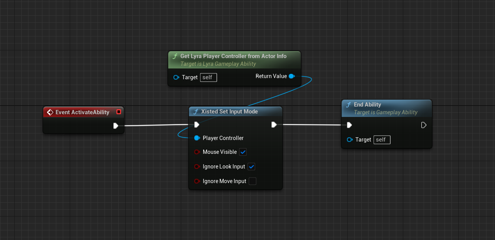

# How to Take Control of the Mouse in Lyra

[Lyra](/UE5/LyraStarterGame/)
uses [CommonUI](/UE5/CommonUI/)
to manage the menu system and widgets in Lyra-based games.
For a big picture overview of how it is all plugged together,
see my [Lyra Input Overview](/UE5/LyraStarterGame/Input/).

This tutorial will show you how to take full control over the mouse and
input mode in your Lyra-based game.

This is useful if you want to:

- Allow the user to use the mouse while playing the game (e.g. not just for menu navigation)
- Change input modes during game play

[TODO VIDEO LINK TODO](#TODO)


## Conceptual Overview

1. You must use CommonUI to change input modes
  - DO NOT USE THE OLD DEPRECATED UE4 METHODS, they do not work in Lyra

2. Override the base [CommonUI Action Router](/UE5/CommonUI/ActionRouter)
  - Completely override its `ApplyUIInputConfig` method
  - For example see [Xisted UI Action Router](#XistedUIActionRouter)

3. Create your own "change input mode" method(s)
  - These must call CommonUI's Action Router `SetActiveUIInputConfig` method to commit the input mode change
  - For example see [XistedSetInputMode](#XistedSetInputMode)


<a id='XistedUIActionRouter'></a>
## Example Action Router

| File Type | URL                                                                                                                                         |
|-----------|---------------------------------------------------------------------------------------------------------------------------------------------|
| Header    | [XistedUIActionRouter.h](https://github.com/XistGG/LyraMouseTutorial/blob/main/Source/LyraMouseTutorial/Public/XistedUIActionRouter.h)      |
| CPP       | [XistedUIActionRouter.cpp](https://github.com/XistGG/LyraMouseTutorial/blob/main/Source/LyraMouseTutorial/Private/XistedUIActionRouter.cpp) |

In this example override of `UCommonUIActionRouterBase`,
I implement a complete override of the `ApplyUIInputConfig` method.
See the comments in the header file for more details.

Note that you **DO NOT** need to keep the same implementation I am using here.
You may want your game input modes to function differently.
Modify the implementation as needed.


<a id='XistedSetInputMode'></a>
## Example Input Mode Changing

| File Type | URL                                                                                                                                             |
|-----------|-------------------------------------------------------------------------------------------------------------------------------------------------|
| Header    | [XistedInputModeStatics.h](https://github.com/XistGG/LyraMouseTutorial/blob/main/Source/LyraMouseTutorial/Public/XistedInputModeStatics.h)      |
| CPP       | [XistedInputModeStatics.cpp](https://github.com/XistGG/LyraMouseTutorial/blob/main/Source/LyraMouseTutorial/Private/XistedInputModeStatics.cpp) |

This is an example of a Blueprint Function Library that provides a single static C++
method that can be used by either C++ or Blueprint code.

In this example, there are 3 possible switches:

- Set mouse visible? (bool)
- Ignore look input? (bool)
- Ignore move input? (bool)

You must pass in the Player Controller whose input mode you wish to change, and then
based on the settings of these 3 switches, it will compute the appropriate
CommonUI `FUIInputConfig`, set the mouse visibility and then call the
CommonUI Action Router's `SetActiveUIInputConfig` method.


### C++ Usage Example

```c++
APlayerController* PC = /*YOU_MUST_SET_THIS*/;

bool bVisibleMouse = true;
bool bIgnoreLook = true;
bool bIgnoreMove = false;

UXistedInputModeStatics::XistedSetInputMode(PC, bVisibleMouse, bIgnoreLook, bIgnoreMove);
```


### Blueprint Usage Example

In this example Gameplay Ability blueprint, we're calling the static
blueprint function library method `XistedSetInputMode` to change the
input mode of the Player Controller that currently owns the ability.

[](./screenshots/ChangeInputMode.png)


## Make it work like you want

You may want a different implementation.  Great.  Make it work the way you want.
This code will get you started and you can customize as you like.


### Things to Pay Attention To

In this example code, I have it set to use `CapturePermanently_IncludingInitialMouseDown`
mouse capture mode whenever the mouse is invisible.
This is the typical setting for an FPS game where the mouse is used for the look/aim
and generally you don't want it to be visible.

During the time when we DO want the mouse to be visible, I'm instead using
`CaptureDuringMouseDown` which doesn't capture the mouse UNLESS the mouse is down.
This means that every single click (when the mouse is over the game viewport)
will be sent to the Game and can be used in game.

If you instead use something like `NoCapture`, then the first click will be "lost"
and only every other click will go to the game.

These settings, and more, are highly game specific, so play with them until you find
the settings that are right for your game.
