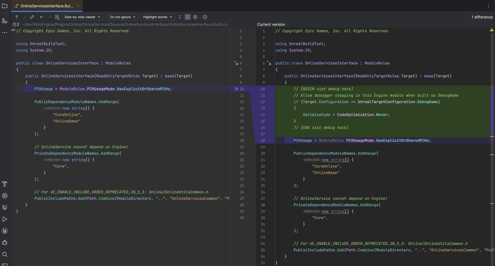

# Online Services

The Online Services plugin is some of the new hotness in UE 5.1+.
Though it's still in beta as of UE 5.5, if your new game intends to upgrade
to subsequent UE 5 versions, Epic recommends using Online Services (OSSv2)
rather than the old soon-to-be-deprecated Online Subsystem (OSSv1).

[LyraStarterGame](/UE5/LyraStarterGame/) is the example Epic has published
that intends to demonstrate how to use the new Online Services plugin.
It does so via the
[Common User](https://dev.epicgames.com/documentation/en-us/unreal-engine/common-user-plugin-in-unreal-engine-for-lyra-sample-game)
plugin that ships with Lyra.

The information in this document is based on Lyra's implementation of
Online Services and Common User, given a Lyra project that has been configured
to use OSSv2 *(NOT the default configuration as of UE 5.5)*.
To upgrade your Lyra config for OSSv2 see this
[official Epic documentation](https://dev.epicgames.com/documentation/en-us/unreal-engine/common-user-plugin-in-unreal-engine-for-lyra-sample-game#usingtheonlineservicesplugin).

# EOS Configuration

In general the Epic docs for how to configure EOS are good, but when I initially set this up in
my project, I found the INI a bit confusing.  To make it more clear, here is the diff you will
need to make to the EOS INI:

| Default Config/Custom/EOS/DefaultEngine.ini                                                                                                                                      | Modified Config/Custom/EOS/DefaultEngine.ini                                                                                                                                              |
|---|---|
| <code>;+[OnlineServices.EOS] ;+ProductId=PRODUCTID ;+SandboxId=SANDBOXID ;+DeploymentId=DEPLOYTMENTID ;+ClientId=CLIENTID ;+ClientSecret=CLIENTSECRET</code> | <code>[OnlineServices.EOS] ProductId=PRODUCTID SandboxId=SANDBOXID DeploymentId=DEPLOYTMENTID ClientId=CLIENTID ClientSecret=CLIENTSECRET</code> |

In other words, don't just uncomment the default settings, as Epic says,
but also remove the leading `+` character from each of the lines.

Though a leading `+` is required in some cases in INI files, they are NOT wanted here.

# Game Initialization

The Common User plugin defines the `CommonUserBasicPresence` Game Instance Subsystem, which
declares `CommonSessionSubsystem` as a dependency.

When the `GameInstance` initializes, these subsystems are initialized as well.

During init, the `CommonSessionSubsystem` grabs a reference to the game's default Online Services
interface and to that service's `Lobbies` interface.

*Notice:* If you're getting an exception here where
`OnlineServices->GetLobbiesInterface()`
is returning `nullptr`, that means your EOS config is not correct!

## Interesting Initialization Methods

### `FOnlineServicesEOSGS::Init`

`FOnlineServicesEOS` is derived from `FOnlineServicesEOSGS`, so this is executed during EOS `Init`.

This loads the `EOSShared` module if needed and verifies the EOS SDK has initialized successfully.

It then loads the platform-specific config from Config files, looking in the `[OnlineServices.EOS]` section,
which you must have correctly configured for your project.

### `FOnlineServicesRegistry::CreateServices`

This is the method that actually instantiates an Online Service (such as `Epic` for EOS).
If you want to understand what exactly goes into constructing and initializing an Online Service,
breakpoint this method in your debugger.

In the case of the `Epic` Online Service (EOS), the `FOnlineServicesFactoryEOS` class is the factory
that creates new Online Service instances, with its `Create` method instantiating a shared pointer
to a new `FOnlineServicesEOS` class.

### `FOnlineServicesEOSModule::StartupModule`

This method is run when the `FOnlineServicesEOSModule` loads.
It registers `EOnlineServices::Epic` with the `FOnlineServicesRegistry`.

This is why later calls to `FOnlineServicesRegistry::CreateServices`
are able to create new `Epic` Online Services insteances.

# Debugging Tips

To make it easier to debug and test Online Services code, I recommend disabling code optimization
in a few Engine `Target.cs` build scripts, including:

- `Engine/Plugins/Online/OnlineServices/Source/OnlineServicesCommon/OnlineServicesCommon.Build.cs`
- `Engine/Plugins/Online/OnlineServices/Source/OnlineServicesCommonEngineUtils/OnlineServicesCommonEngineUtils.Build.cs`
- `Engine/Plugins/Online/OnlineServices/Source/OnlineServicesInterface/OnlineServicesInterface.Build.cs`
- `Engine/Plugins/Online/OnlineServicesNull/Source/OnlineServicesNull.Build.cs`

### Example Diff for `OnlineServicesInterface.Build.cs`

# Recommended Reading

- [Using Lyra With Epic Online Services](https://dev.epicgames.com/documentation/en-us/unreal-engine/using-lyra-with-epic-online-services-in-unreal-engine)
- [Common User Plugin](https://dev.epicgames.com/documentation/en-us/unreal-engine/common-user-plugin-in-unreal-engine-for-lyra-sample-game)
