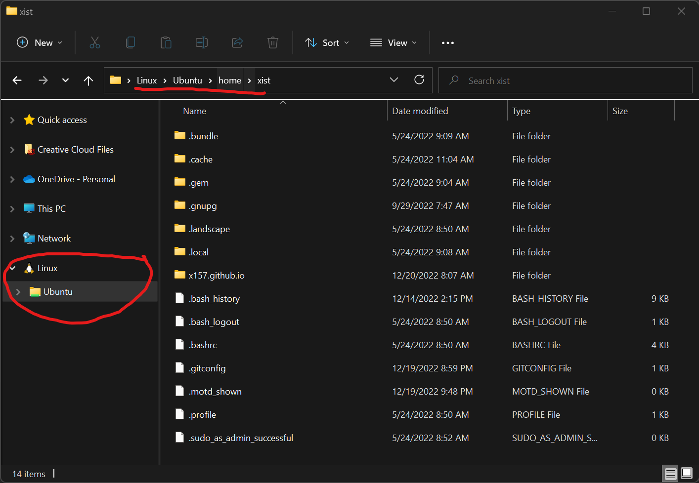
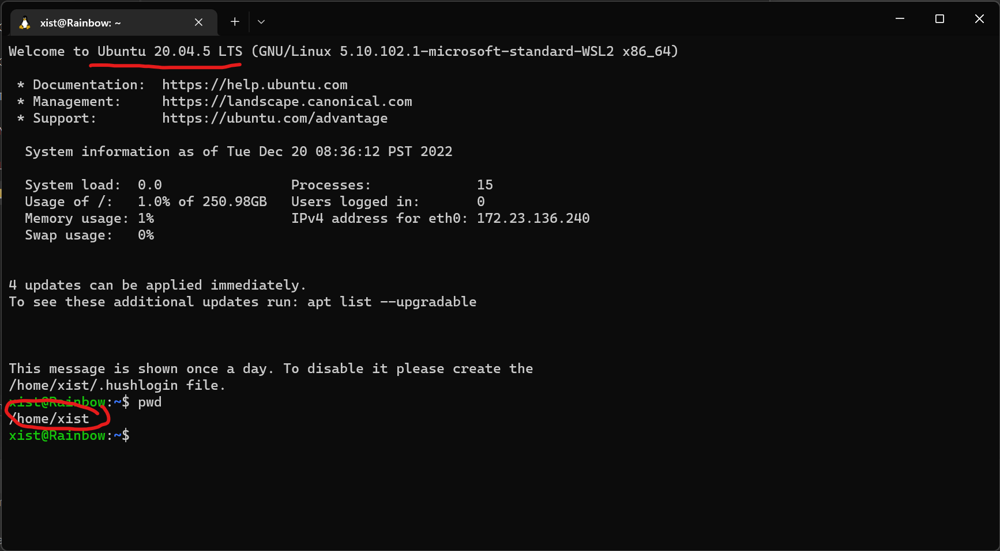

# Windows Dev Notes

Some notes and thoughts regarding using Windows as a dev platform, from the perspective
of an expert Unix dev.

## Use Windows `Terminal` with the latest `PowerShell`

Pretend the `cmd` prompt does not exist.  It is one of the most pathetic things to ever happen
to an operating system.

The Windows `Terminal`, on the other hand, is actually a useful tool.
Combine it with the latest version of `PowerShell` and after a while you'll start
to think it's even nicer than `bash` in your old Unix or Mac terminal.  Because it is.

## Windows Defender Exclusions

**DISABLE Anti-virus and Windows Defender from performing real-time
scans on source directories.**

If you fail to do this, every time you switch branches (which can affect 10000s of files in UE),
it will re-scan for viruses.  It's an insane waste of time.  Just turn it off.

Corollary: Keep viruses out of your source directories.  `:P`

## Use WSL (Linux on Windows)

[Install Linux on Windows with WSL](https://learn.microsoft.com/en-us/windows/wsl/install)

I really cannot say enough good things about WSL.  You don't need or want VMWare anymore.
WSL is so much easier to install and work with, and you can edit your Linux files
directly from Windows, as if it were a NAS.

Super easy to access Linux filesystem from Windows Explorer:

Run Linux bash natively in Windows Terminal:

## Windows Registry

I suggest being familiar with my discussion of
[UE5-specific Windows Registry Keys](/UE5/Windows-Registry-Keys).
Windows loves its registry and you can discover some interesting things there.

In particular, see the [Custom Engine Alias](/UE5/Windows-Registry-Keys#CustomEngineAlias)
section if you're working with a team using a custom Engine build.

## Windows xcopy ~ Unix rsync

This will sync remote `\\NAS\Share`'s `\Folder` with local `C:\Folder`,
with settings that make sense to me, similar to what one would expect from rsync.  (See
[xcopy docs](https://learn.microsoft.com/en-us/windows-server/administration/windows-commands/xcopy)
for more info).

`xcopy \\NAS\Share\Folder C:\Folder /D /I /E /Y /H /R /F`

This is great for sharing temporary/experimental custom Engine builds over the LAN, for example.
